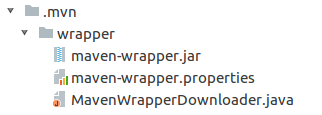

# springboot-dubbo-study
springboot-dubbo学习

## 解决Maven版本不同的问题
在项目根目录下执行Maven命令：  
mvn -N io.takari:maven:wrapper -Dmaven=3.1.0  
执行上述命令后在项目根目录下会生成以下目录和文件  
__目录__  
  
__文件__  
  

Linux环境执行命令：  
./mvnw clean install  

Windows环境执行命令  
./mvnw.cmd clean install
